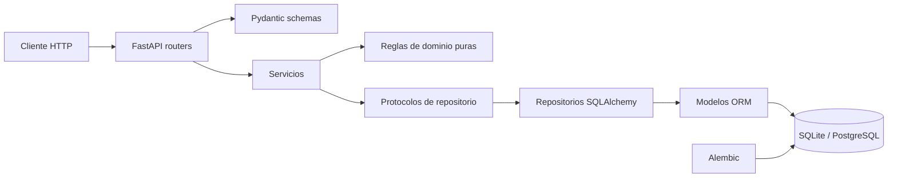

[](https://github.com/Jesus7810/sdlc-electronica-jesus-castillo/actions/workflows/ci.yml)

# SensorHub API

SensorHub es una API REST de telemetría IoT desarrollada para el proyecto final
de Semana 6 de EDSIA. Permite configurar sensores con límites físicos y
umbrales operativos, registrar lecturas trazables, gestionar alertas y consultar
estadísticas, con una ejecución reproducible en SQLite o PostgreSQL.

## Capacidades actuales

- Configuración v2 de sensores con ubicación, límites físicos y cuatro umbrales
  operativos estrictamente ordenados.
- Desactivación lógica y reactivación idempotente de sensores, sin perder su
  historial.
- Registro de lecturas inmutables, con timestamps con zona horaria normalizados
  a UTC y unicidad por sensor e instante.
- Clasificación de anomalías `WARNING` y `CRITICAL` para condiciones `low` y
  `high`.
- Apertura, actualización, escalamiento, reconocimiento y resolución manual de
  alertas trazables.
- Consulta de lecturas paginada y por rango temporal, además de estadísticas
  agregadas por sensor.
- Liveness, readiness y métricas operativas en formato Prometheus.
- Migraciones Alembic, pruebas automatizadas, análisis estático, Docker Compose
  y validación de migraciones sobre PostgreSQL en CI.

## Arquitectura

La aplicación aplica la arquitectura por capas definida en el
[ADR 0001](docs/adr/0001-arquitectura-en-capas.md). Los routers se ocupan del
contrato HTTP; los servicios coordinan los casos de uso; las reglas puras del
dominio no dependen de FastAPI ni de SQLAlchemy; y los repositorios encapsulan
la persistencia.



La política funcional de sensores, lecturas y alertas se documenta en el
[ADR 0002](docs/adr/0002-ciclo-de-vida-de-sensores-y-alertas.md). La separación
entre liveness, readiness y métricas se documenta en el
[ADR 0003](docs/adr/0003-observabilidad-liveness-readiness-y-metricas.md).

## Requisitos

- Python 3.12.
- Docker Engine o Docker Desktop con Docker Compose para ejecutar PostgreSQL en
  contenedores.

## Ejecución local con SQLite

La aplicación usa `sqlite:///sensorhub.db` si `DATABASE_URL` no está definida.
Para una instalación local nueva:

```bash
python -m venv .venv
```

Activa el entorno antes de continuar:

```powershell
.venv\Scripts\Activate.ps1
```

En Linux o macOS:

```bash
source .venv/bin/activate
```

Después instala dependencias, aplica el esquema e inicia la API:

```bash
python -m pip install --require-hashes -r requirements.txt
python -m alembic upgrade head
python -m uvicorn app.main:app --reload
```

La API queda disponible en `http://127.0.0.1:8000`; la documentación interactiva
está en `http://127.0.0.1:8000/docs`.

Las dependencias directas se mantienen en `requirements.in`. El archivo
`requirements.txt` es el lock generado con versiones exactas y hashes; se
actualiza de forma deliberada en Python 3.12 y es el único archivo que deben
instalar Docker, CI y los entornos locales.

> **Advertencia de migración:** las migraciones de configuración v2 y ciclo de
> vida se diseñaron para una base histórica vacía. No ejecutes `alembic upgrade
> head` sobre una base previa sin respaldo y un plan explícito de migración de
> datos.

Las pruebas no utilizan `sensorhub.db`: usan una base SQLite temporal aislada.

## Ejecución con Docker Compose

La definición de [docker-compose.yml](docker-compose.yml) separa claramente el
arranque de PostgreSQL, las migraciones y la API:

```text
db (healthy) → migrate (alembic upgrade head, exit 0) → api (Uvicorn, healthy)
```

1. Crea un archivo local `.env` a partir de
   [.env.example](.env.example) y sustituye los valores de ejemplo por
   credenciales locales. No incluyas credenciales reales ni de producción.
2. Construye e inicia los servicios:

   ```bash
   docker compose up --build
   ```

3. Comprueba el estado de los servicios:

   ```bash
   docker compose ps
   ```

   El servicio `migrate` debe haber terminado correctamente y `api` debe estar
   healthy. La API se expone en `http://localhost:8000`.

4. Detén únicamente los contenedores del proyecto, preservando el volumen de
   PostgreSQL:

   ```bash
   docker compose down
   ```

El servicio `migrate` usa la misma imagen local que `api`, no expone puertos y
ejecuta solo `alembic upgrade head`. La API depende de que finalice con éxito y
ejecuta solamente Uvicorn. Consulta también el [Dockerfile](Dockerfile) y la
configuración de [Alembic](alembic.ini).

## Migraciones

Alembic mantiene el esquema reproducible tanto para SQLite como para PostgreSQL.
Los comandos habituales son:

```bash
python -m alembic upgrade head
python -m alembic current --check-heads
```

Antes de una migración sobre una base con datos, revisa la cadena de revisiones
y realiza un respaldo. La advertencia sobre datos históricos indicada arriba es
especialmente importante para esquemas anteriores a SensorHub v2.

## Endpoints clave

La especificación completa está disponible en `/docs`. Estas son las rutas de
uso principal:

| Método | Ruta | Comportamiento |
|---|---|---|
| `POST` | `/sensors` | Crea un sensor con configuración v2. |
| `GET` | `/sensors?include_inactive=false` | Lista sensores activos por defecto. |
| `GET`, `PATCH` | `/sensors/{sensor_id}` | Consulta o actualiza la configuración del sensor. |
| `POST` | `/sensors/{sensor_id}/deactivate` | Desactiva el sensor de forma idempotente. |
| `POST` | `/sensors/{sensor_id}/activate` | Reactiva el sensor de forma idempotente. |
| `POST` | `/sensors/{sensor_id}/readings` | Registra una lectura. |
| `GET` | `/sensors/{sensor_id}/readings` | Consulta lecturas con paginación y filtros `from`/`to`. |
| `GET` | `/sensors/{sensor_id}/readings/statistics` | Obtiene mínimo, máximo, promedio y cantidad. |
| `GET` | `/readings/{reading_id}` | Consulta una lectura inmutable. |
| `GET` | `/alerts` | Lista alertas no resueltas por defecto; admite filtros y paginación. |
| `GET` | `/alerts/{alert_id}` | Consulta el detalle de una alerta. |
| `POST` | `/alerts/{alert_id}/acknowledge` | Transición de `open` a `acknowledged`. |
| `POST` | `/alerts/{alert_id}/resolve` | Resuelve una alerta `open` o `acknowledged`. |
| `GET` | `/health` | Liveness del proceso HTTP, sin consultar la base de datos. |
| `GET` | `/ready` | Readiness: comprueba la disponibilidad de la base de datos. |
| `GET` | `/metrics` | Métricas Prometheus de solo lectura. |

Las rutas heredadas `POST /readings` y `GET /readings` se mantienen por
compatibilidad. No existen rutas públicas para borrar sensores ni para editar o
borrar lecturas; los métodos no admitidos devuelven `405` cuando corresponde.

## Ejemplos HTTP

Crear un sensor de temperatura con configuración v2:

```http
POST /sensors
Content-Type: application/json

{
  "id": "TEMP-01",
  "name": "Temperatura del laboratorio",
  "location": "Laboratorio de electrónica",
  "type": "temperature",
  "unit": "C",
  "min_value": -40,
  "low_critical_threshold": -20,
  "low_warning_threshold": -10,
  "high_warning_threshold": 30,
  "high_critical_threshold": 40,
  "max_value": 50
}
```

Registrar una lectura con timestamp UTC explícito:

```http
POST /sensors/TEMP-01/readings
Content-Type: application/json

{
  "value": 35,
  "unit": "C",
  "timestamp": "2026-08-24T12:00:00Z"
}
```

Consultar estadísticas en un rango inclusivo UTC:

```http
GET /sensors/TEMP-01/readings/statistics?from=2026-08-24T00:00:00Z&to=2026-08-24T23:59:59Z
```

Reconocer o resolver una alerta existente:

```http
POST /alerts/1/acknowledge
POST /alerts/1/resolve
```

Consultar observabilidad:

```bash
curl http://127.0.0.1:8000/health
curl http://127.0.0.1:8000/ready
curl http://127.0.0.1:8000/metrics
```

## Reglas de dominio principales

### Sensores y umbrales

Cada sensor tiene `location`, límites físicos y cuatro umbrales operativos. Debe
cumplirse esta cadena estricta:

```text
min_value < low_critical_threshold < low_warning_threshold < high_warning_threshold < high_critical_threshold < max_value
```

Los límites físicos determinan si una lectura es aceptable. Una lectura fuera de
`min_value` y `max_value` se rechaza: no se persiste ni genera una alerta. Los
umbrales operativos clasifican las lecturas físicamente válidas como normales,
`WARNING` o `CRITICAL`.

### Lecturas y UTC

Las lecturas son inmutables. Un timestamp explícito debe incluir offset o zona
horaria; la API lo normaliza a UTC antes de persistirlo, filtrarlo y devolverlo.
Si se omite, el sistema genera el timestamp en UTC. Los filtros temporales
`from` y `to` también requieren zona horaria y son inclusivos.

La combinación `(sensor_id, timestamp)` es única para el instante UTC
normalizado. Un intento duplicado devuelve `409 Conflict`.

### Ciclo de vida de sensores

Un sensor nuevo está activo. Desactivarlo conserva sus lecturas y alertas,
elimina el sensor de los listados normales e impide nuevas lecturas con `409`.
Las operaciones de activar y desactivar son idempotentes. Las estadísticas y la
consulta individual conservan acceso al historial de sensores inactivos.

### Alertas

Una alerta posee condición `low` o `high`, severidad `WARNING` o `CRITICAL` y
estado `open`, `acknowledged` o `resolved`. Las alertas `open` y
`acknowledged` no están resueltas; solo puede existir una por sensor y condición
en esos estados. La evidencia de origen y la última evidencia anómala se
conservan separadamente.

Una alerta se reconoce manualmente y se resuelve manualmente. Una lectura normal
no la cierra. Una alerta reconocida que escala de `WARNING` a `CRITICAL` vuelve
a `open` y conserva su primer reconocimiento histórico.

### Estadísticas

`GET /sensors/{sensor_id}/readings/statistics` calcula `count`, mínimo, máximo y
promedio en la base de datos. Sin lecturas en un rango válido devuelve `200` con
`count: 0` y agregados `null`; un sensor inactivo conserva acceso a su historial.

## Observabilidad

- `/health` devuelve `200 {"status":"ok"}` si el proceso HTTP está vivo y no
  depende de la base de datos.
- `/ready` devuelve `200 {"status":"ready"}` cuando la base está disponible;
  ante indisponibilidad de infraestructura devuelve `503
  {"status":"unavailable"}` sin revelar detalles internos.
- `/metrics` emite Prometheus text format y las gauges
  `sensorhub_active_sensors`, `sensorhub_registered_readings` y
  `sensorhub_unresolved_alerts`. Esta última incluye alertas `open` y
  `acknowledged`.

## Calidad y CI

Ejecuta las comprobaciones locales con el intérprete del proyecto:

```bash
python -m ruff check .
python -m mypy app
python -m pytest -v
```

La configuración de [GitHub Actions](.github/workflows/ci.yml) contiene dos
jobs: uno de calidad y pruebas sobre SQLite, y otro que inicia PostgreSQL 16
limpio, comprueba la conexión y ejecuta `alembic upgrade head` seguido de
`alembic current --check-heads`. El workflow solo usa credenciales públicas y
efímeras de CI; no consume `.env` ni secretos de producción.

## Despliegue

El repositorio contiene configuración de Render en [render.yaml](render.yaml).
Este documento no afirma que exista una URL pública ni un despliegue activo: ese
estado debe verificarse en el entorno de Render antes de comunicarlo.

Docker Compose resuelve el orden de migración con un servicio único `migrate`.
El Dockerfile se mantiene con migración al arranque para la configuración actual
de Render free, que no dispone de un `preDeployCommand` equivalente. Ese enfoque
es adecuado solo para una instancia: antes de escalar deben incorporarse un
release job o un mecanismo de bloqueo de migraciones para evitar carreras.

## Trazabilidad de decisiones

- [ADR 0001 — Arquitectura en capas](docs/adr/0001-arquitectura-en-capas.md)
- [ADR 0002 — Ciclo de vida de sensores y alertas](docs/adr/0002-ciclo-de-vida-de-sensores-y-alertas.md)
- [ADR 0003 — Observabilidad: liveness, readiness y métricas](docs/adr/0003-observabilidad-liveness-readiness-y-metricas.md)
- [AI_LOG.md](AI_LOG.md)

## Autor

**Jesús Roberto Castillo López**
Estudiante de Ingeniería en Instrumentación Electrónica y participante de EDSIA
— De Electrónica a Desarrollo de Software con IA.
