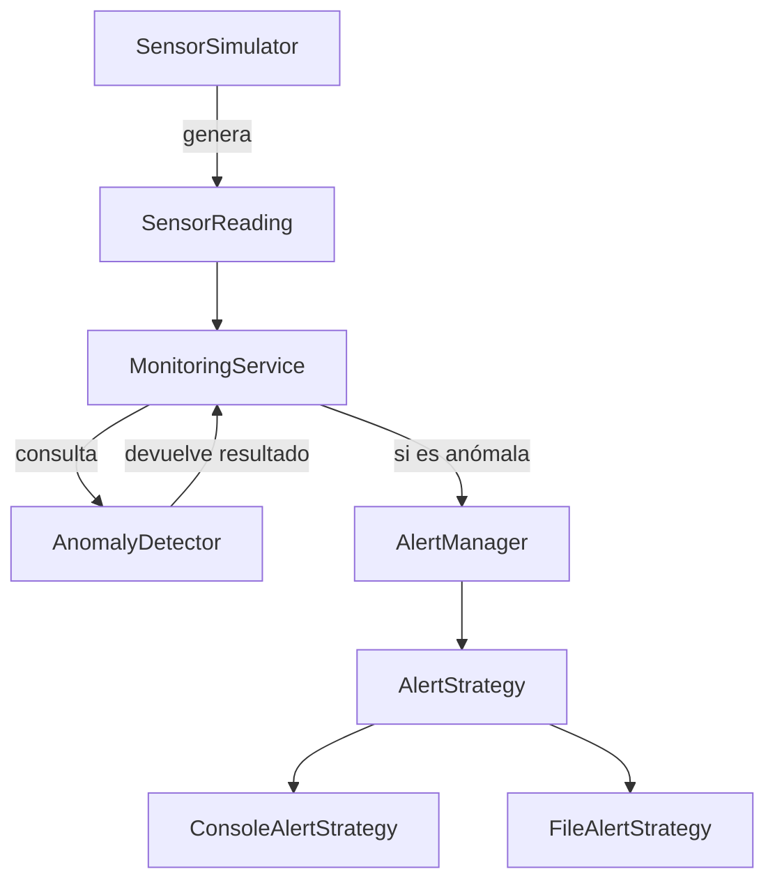

# Arquitectura del sistema

## Descripción general

El sistema está dividido en componentes con responsabilidades específicas. La intención es evitar que una sola clase se encargue de generar lecturas, detectar anomalías y enviar alertas.

El flujo principal es:

1. `SensorSimulator` genera una lectura.
2. `MonitoringService` recibe y almacena la lectura.
3. `AnomalyDetector` determina si el valor supera el umbral correspondiente.
4. Si existe una anomalía, `MonitoringService` solicita a `AlertManager` el envío de una alerta.
5. `AlertManager` delega el envío a la estrategia configurada.

## Componentes

### SensorReading

Representa una lectura de sensor mediante los siguientes datos:

- Identificador del sensor.
- Tipo de medición.
- Valor registrado.
- Fecha y hora de la medición.

Es una `dataclass` inmutable porque una lectura representa un evento histórico y no debería modificarse después de su creación.

### SensorSimulator

Genera objetos `SensorReading` utilizando una distribución gaussiana.

Cada simulador recibe:

- Identificador del sensor.
- Tipo de medición.
- Media.
- Desviación estándar.
- Semilla.

La semilla permite generar secuencias reproducibles, lo que facilita las pruebas y la detección de errores.

### AnomalyDetector

Determina si una lectura es anómala comparando su valor con el umbral correspondiente a su tipo.

Los umbrales de temperatura y humedad se reciben mediante el constructor. Esto evita valores fijos dentro de la clase y permite cambiar la configuración sin modificar su implementación.

### AlertManager

Coordina el envío de alertas, pero no conoce la forma concreta en que se envían.

Depende del protocolo `AlertStrategy`, que establece el siguiente contrato:

```python
def send(self, message: str) -> None: ...
```

Actualmente existen dos implementaciones:

- `ConsoleAlertStrategy`: muestra las alertas en la consola.
- `FileAlertStrategy`: agrega las alertas a un archivo.

También pueden crearse nuevas estrategias sin modificar `AlertManager`, siempre que cumplan el contrato de `AlertStrategy`.

### MonitoringService

Coordina el flujo completo del monitoreo:

- Recorre los ciclos de simulación.
- Solicita una lectura a cada simulador.
- Conserva las lecturas generadas.
- Consulta al detector de anomalías.
- Solicita el envío de una alerta cuando corresponde.

No contiene la lógica interna de simulación, detección o envío de alertas. Su responsabilidad consiste únicamente en coordinar los demás componentes.

## Relación entre componentes



## Flujo de monitoreo

Durante la ejecución del sistema, `MonitoringService` recorre los ciclos configurados y solicita una lectura a cada `SensorSimulator`.

Cada lectura se agrega a la colección de resultados y se envía a `AnomalyDetector`. Si el valor supera el umbral correspondiente, se crea un mensaje y se solicita su envío a `AlertManager`.

En la prueba de integración se utilizan 10 sensores durante 60 ciclos, por lo que se generan:

```text
10 sensores × 60 ciclos = 600 lecturas
```

Cada lectura anómala produce exactamente una alerta.

## Principios aplicados

### Responsabilidad única

Cada componente tiene una responsabilidad principal:

- `SensorReading` representa los datos de una lectura.
- `SensorSimulator` genera lecturas.
- `AnomalyDetector` evalúa si una lectura es anómala.
- `AlertManager` administra el envío de alertas.
- `MonitoringService` coordina el proceso completo.

Esta separación facilita comprender, probar y modificar cada parte del sistema.

### Abierto/cerrado

Es posible agregar nuevas estrategias de alerta sin modificar `AlertManager`, siempre que cumplan el contrato definido por `AlertStrategy`.

Por ejemplo, en el futuro podría agregarse una estrategia para enviar alertas por correo electrónico o mensajería.

### Inversión de dependencias

`AlertManager` depende del protocolo `AlertStrategy` y no directamente de las estrategias de consola o archivo. La implementación concreta se inyecta desde el exterior.

`AnomalyDetector` y `AlertManager` también se inyectan en `MonitoringService`. Esto reduce el acoplamiento entre las clases y facilita sustituir sus dependencias durante las pruebas.

## Decisiones de diseño

- Las lecturas son inmutables porque representan eventos históricos.
- Los umbrales se inyectan para poder configurarlos y probar diferentes escenarios.
- Las estrategias de alerta son intercambiables.
- El archivo de alertas se abre en modo de adición para no sobrescribir mensajes anteriores.
- Cada simulador utiliza su propio generador aleatorio.
- La semilla permite repetir exactamente una secuencia de valores.
- `MonitoringService` coordina los componentes sin asumir sus responsabilidades internas.

## Alcance actual

Esta arquitectura corresponde a una primera versión del sistema. Las lecturas se conservan en memoria y las alertas pueden enviarse a consola o archivo.

En futuras versiones podrían incorporarse:

- Persistencia en una base de datos.
- Nuevos tipos de medición.
- Configuración externa de sensores y umbrales.
- Nuevas estrategias de alerta.
- Fechas diferentes para cada ciclo de monitoreo.

Estas extensiones podrían agregarse manteniendo la separación actual de responsabilidades.